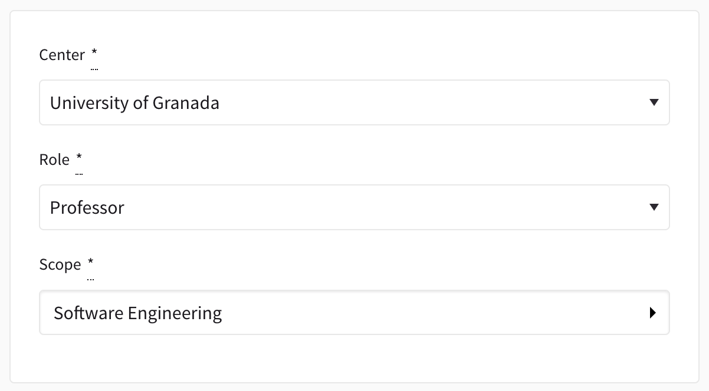
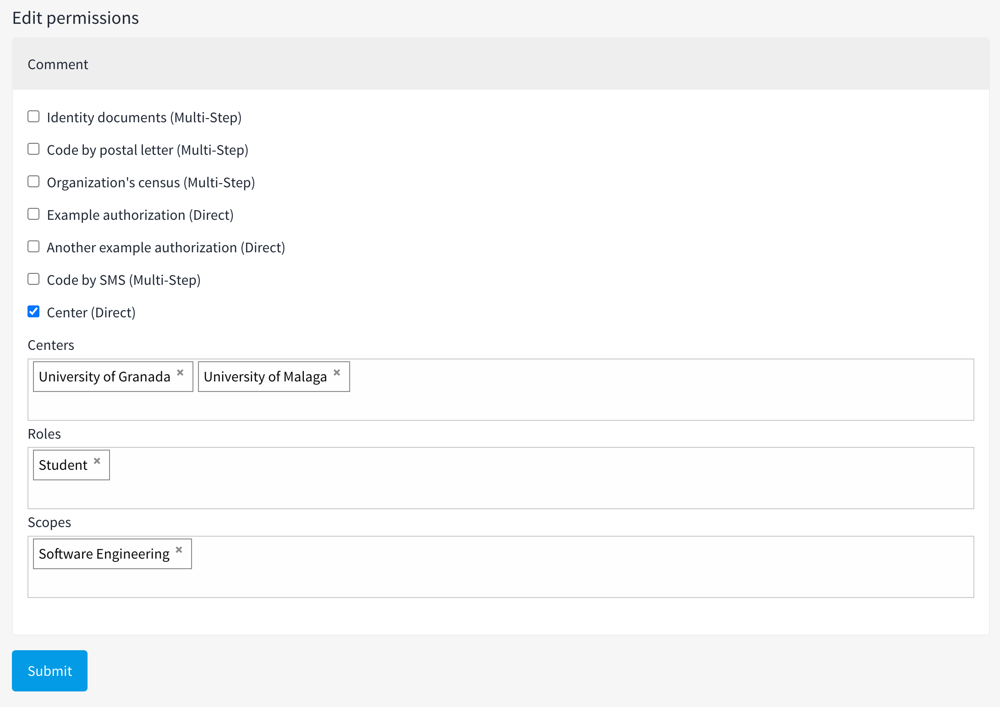

# Decidim::Centers

[](https://badge.fury.io/rb/decidim-centers)
[![[CI] Lint](https://github.com/Platoniq/decidim-module-centers/actions/workflows/lint.yml/badge.svg)](https://github.com/Platoniq/decidim-module-centers/actions/workflows/lint.yml)
[![[CI] Test](https://github.com/Platoniq/decidim-module-centers/actions/workflows/test.yml/badge.svg)](https://github.com/Platoniq/decidim-module-centers/actions/workflows/test.yml)
[](https://codeclimate.com/github/Platoniq/decidim-module-centers/maintainability)
[](https://codecov.io/gh/Platoniq/decidim-module-centers)

Manage your centers and scopes so the users can be authorized over them. As an admin you will be able
to create centers and scopes (we use the model Decidim currently provides).

When a user signs up in the platform two new fields will appear in the registration form.

- **Center**: Where the user works. For example: "University of Granada"
- **Scope**: The work scope in which the user works. For example: "Computer Science"



Users can change the values anytime they want from the profile page.

When they create the account or update their values, a `center` authorization will be created or updated
with the value of the center and scope the user has selected.

As an admin you will be able to configure the permissions of a component restricting the access to
specific centers and scopes. When you select multiple centers or scopes they work as "or". When you specify
both the center and the scope it will work as an "and" between them.



## Installation

Add this line to your application's Gemfile:

```ruby
gem "decidim-centers", "~> 0.1.0"
```

And then execute:

```bash
bundle
```

Install (and run) migrations:

```bash
bundle exec rails decidim_centers:install:migrations
bundle exec rails db:migrate
```

Depending on your Decidim version, choose the corresponding version to ensure compatibility:

| Version | Compatible decidim versions |
|---------|-----------------------------|
| 0.1.x   | v0.27.x                     |

## Configuration

You can customize your installation using the environment variables below:

| ENV                                  | Description                                               | Default | Example      |
|--------------------------------------|-----------------------------------------------------------|---------|--------------|
| DECIDIM_CENTERS_SCOPES_ENABLED       | Use scopes to categorize users too along with the centers | true    | false        |

> **IMPORTANT**: Remember to activate the verification method `center` in the
> Decidim `/system` admin page for your organization.

## Contributing

See [Decidim](https://github.com/decidim/decidim).

### Developing

To start contributing to this project, first:

- Install the basic dependencies (such as Ruby and PostgreSQL)
- Clone this repository

Decidim's main repository also provides a Docker configuration file if you
prefer to use Docker instead of installing the dependencies locally on your
machine.

You can create the development app by running the following commands after
cloning this project:

```bash
bundle
DATABASE_USERNAME=<username> DATABASE_PASSWORD=<password> bundle exec rake development_app
```

Note that the database user has to have rights to create and drop a database in
order to create the dummy test app database.

Then to test how the module works in Decidim, start the development server:

```bash
cd development_app
DATABASE_USERNAME=<username> DATABASE_PASSWORD=<password> bundle exec rails s
```

In case you are using [rbenv](https://github.com/rbenv/rbenv) and have the
[rbenv-vars](https://github.com/rbenv/rbenv-vars) plugin installed for it, you
can add the environment variables to the root directory of the project in a file
named `.rbenv-vars`. If these are defined for the environment, you can omit
defining these in the commands shown above.

#### Code Styling

Please follow the code styling defined by the different linters that ensure we
are all talking with the same language collaborating on the same project. This
project is set to follow the same rules that Decidim itself follows.

[Rubocop](https://rubocop.readthedocs.io/) linter is used for the Ruby language.

You can run the code styling checks by running the following commands from the
console:

```bash
bundle exec rubocop
```

To ease up following the style guide, you should install the plugin to your
favorite editor, such as:

- Atom - [linter-rubocop](https://atom.io/packages/linter-rubocop)
- Sublime Text - [Sublime RuboCop](https://github.com/pderichs/sublime_rubocop)
- Visual Studio Code - [Rubocop for Visual Studio Code](https://github.com/misogi/vscode-ruby-rubocop)

### Testing

To run the tests run the following in the gem development path:

```bash
bundle
DATABASE_USERNAME=<username> DATABASE_PASSWORD=<password> bundle exec rake test_app
DATABASE_USERNAME=<username> DATABASE_PASSWORD=<password> bundle exec rspec
```

Note that the database user has to have rights to create and drop a database in
order to create the dummy test app database.

## License

This engine is distributed under the [GNU AFFERO GENERAL PUBLIC LICENSE](LICENSE-AGPLv3.txt).
